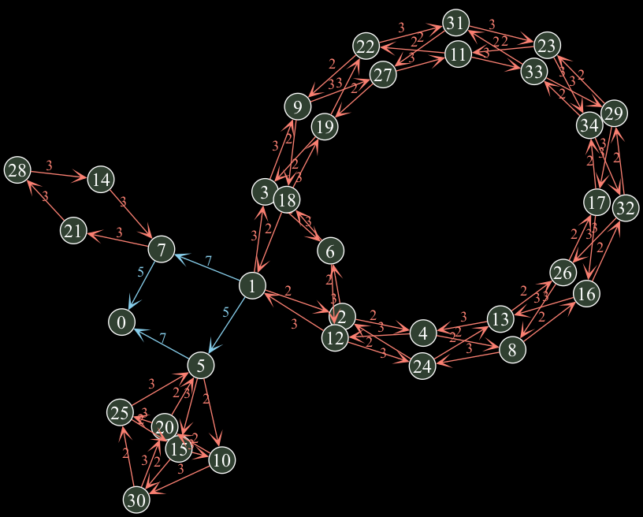
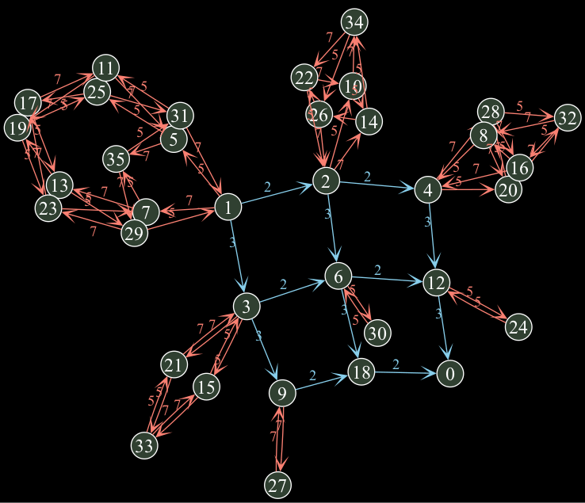
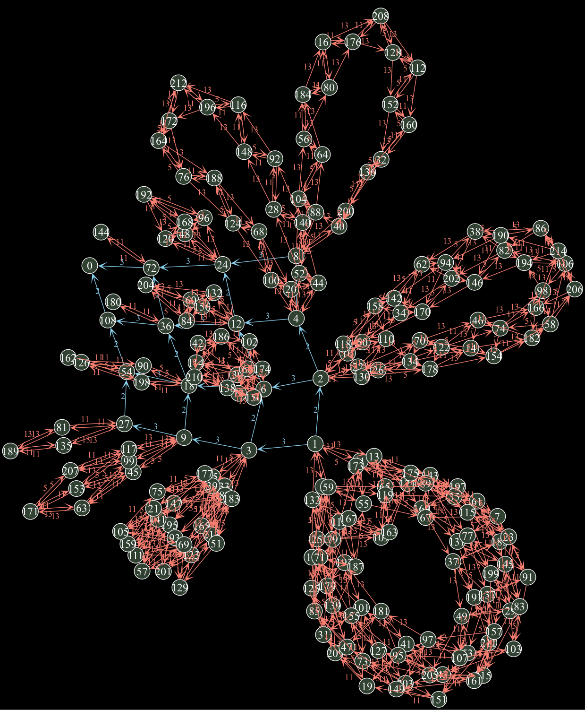

<p align="left">
  <picture>
    <source srcset="docs/images/dissig_logo_dark.jpg" media="(prefers-color-scheme: dark)">
    <source srcset="docs/images/dissig_logo_light.jpg" media="(prefers-color-scheme: light)">
    
  </picture>
</p>

# **Tonal Structures**<br><small>*for*</small> **Harmonic Motion**<br><small>*between*</small> **Discrete Signals**
- **§0.** [Welcome](#tonal-structures-for-harmonic-motion-between-discrete-signals)
- **§1.** [Harmonic movement between discrete signals](#-harmonic-movement-between-discrete-signals)
- **§2.** [Installation and Setup](#-installation-and-setup)

Welcome to `disig`, a Python package that allows users to compute and manipulate [...]

## *TODO*s
- Finish `./README.md`
- separate visualization into two cases, one that can cluster and one that's `"neato"`
- Generate examples with accompanying diagrams
- pylint `./tests`
- Finish TeX documentation
## 

# 1. Harmonic movement between discrete signals
- **1.1** [Tonnetze for continuous signals](##-tonnetez-for-continuous-signals)
  - **1.1.1** [Euler's *tonnetz*](###-eulers-tonnetz)
  - **1.1.2** [Modern tonnetze](###-modern-tonnetz)
- **1.2** [*Tonality* for discrete audio signals](##-tonality-for-discrete-audio-signals)
  - **1.2.1** [Musical intervals for discrete audio signals](###-musical-intervals-for-discrete-audio-signals)
- **1.3** [Large-scale structure of discrete tonnetze](##-large-scale-structure-of-discrete-tonnetze)
  - **1.3.1** [Orbits under the unit group from natural clusters](###-orbits-under-the-unit-group-from-natural-clusters)

## Tonnetze for continuous signals

### Euler's *tonnetz*
A [*tonnetz*](https://en.wikipedia.org/wiki/Tonnetz) (German for "*tone network*," with plural *tonnetze*) is a type of diagram that depicts the intervalic inte-relationship between a collection of pitches, pitch classes, or even chords. One of the first known examples of a tonnetz is a drawing that the mathematician [Leonard Euler](https://en.wikipedia.org/wiki/Leonhard_Euler) included in a 1739 treatise on music theory.

<p align="center">
  <picture>
    <source srcset="docs/images/euler_tonnetz_dark.jpg" media="(prefers-color-scheme: dark)">
    <source srcset="docs/images/euler_tonnetz_light.jpg" media="(prefers-color-scheme: light)">
    
  </picture>
</p>
<p align="center" style="font-size: 80%;">
  Euler's tonnetz
</p>

Today, we tend to depict this same tonnetze as a grid network. This tonnetz depicts the relationship between the 12 pitch classes in a 12-tone equaltempered tuning when we move along the two important diatonic intervals P5 (a *perfect fifth*) and M3 (m *major third*):

<p align="center">
  <picture>
    <source srcset="docs/images/euler_modern_dark.jpg" media="(prefers-color-scheme: dark)">
    <source srcset="docs/images/euler_modern_light.jpg" media="(prefers-color-scheme: light)">
    
  </picture>
</p>
<p align="center" style="font-size: 80%;">
  Our modernized version of Euler's tonnetz.
</p>

Here, we depict the tonnetz as a grid network, instead of Euler's original system of cascading brackets, but the content is essentially identical. We've added dotted arrows along the bottom edges of the diagram to indicate how it loops back along itself along P5 and M3 intervals.

The diagram is interesting from a music theoretical perspecitive because to exhibits lots of important diatonic-based musical phenomena in striking and often quite suggestive geometric patterns. To give just one example, all major and minor triads appear in this tonnetz as [span or cospan diagrams](https://en.wikipedia.org/wiki/Span_(category_theory)):

<p align="center">
  <picture>
    <source srcset="docs/images/triads_in_tonnetz_dark.jpg" media="(prefers-color-scheme: dark)">
    <source srcset="docs/images/triads_in_tonnetz_light.jpg" media="(prefers-color-scheme: light)">
    
  </picture>
</p>
<p align="center" style="font-size: 80%;">
  Major and minor triads appear in Euler's tonnetz as spans and copsans
</p>

### Modern tonnetze
Tonnetze became an important tool to developments in [(musical) set theory](https://en.wikipedia.org/wiki/Set_theory_(music)) and in [neo-Riemann theory](https://en.wikipedia.org/wiki/Neo-Riemannian_theory). For exemplary use of tonnetz in musical analysis, see:
- Dmitri Tymoczko. *A Geometry of Music: Harmony and Counterpoint in the Extended Common Practice*. Oxford Studies in Music Theory. Oxford University Press, March 2011. 480 pages.
- Richard Cohn. *Audacious Euphony: Chromatic Harmony and the Triad’s Second Nature.* Oxford Studies in Music Theory. Oxford University Press, January 2012. 256 pages.
- Edward Gollin and Alexander Rehding, editors. *The Oxford Handbook of Neo-Riemannian Music Theories*. Oxford Handbooks. Oxford University Press, May 2014. 632 pages.

The general pattern in all of this work is a partial import, into music theory, of category theoretical diagrams coming from representation theory, specifically from the repesentation theory of the circle group.

## *Tonality* for discrete audio signals

### Musical intervals for discrete audio signals

We can understand the edges in our modernized version of Euler's tonnetz as *multiplication* operations. Indeed, moving up a perfect fifth corresponds to rescaling playback speed of a continuous audio signal $f(t)$ by a factor of 3/2, i.e., $f(t)\mapsto f(3t/2)$. Likewise, moving up a major third corresponds to rescaling the playback speed of our continuous audio signal by a factor of 5/4, i.e., $f(t)\mapsto f(5t/4)$.

 If we impose [octave equivalence](https://en.wikipedia.org/wiki/Octave#Equivalence), then we ignore all factors of 2 when we rescale playback speed. Up to octave equivalence, movement up a perfect fifth amounts to rescaling the playback speed by any factor of 3, and movement up a major third amounts to rescaling the playback speed by a factor of 5, i.e., $f(t)\mapsto f(3t)$ and $f(t)\mapsto f(5t)$, respectively.

<p align="center">
  <picture>
    <source srcset="docs/images/scaling_signals_continuous_dark.jpg" media="(prefers-color-scheme: dark)">
    <source srcset="docs/images/scaling_signals_continuous_light.jpg" media="(prefers-color-scheme: light)">
    
  </picture>
</p>
<p align="center" style="font-size: 80%;">
  Tonnetz for discrete audio signals with 36 samples
</p>

[...]

<p align="center">
  <picture>
    <source srcset="docs/images/scaling_signals_discrete_dark.jpg" media="(prefers-color-scheme: dark)">
    <source srcset="docs/images/scaling_signals_discrete_light.jpg" media="(prefers-color-scheme: light)">
    
  </picture>
</p>
<p align="center" style="font-size: 80%;">
  Tonnetz for discrete audio signals with 36 samples
</p>

[...]

<p align="center">
  <picture>
    <source srcset="docs/images/tonnetz_36_dark.jpg" media="(prefers-color-scheme: dark)">
    <source srcset="docs/images/tonnetz_36_light.jpg" media="(prefers-color-scheme: light)">
    
  </picture>
</p>
<p align="center" style="font-size: 80%;">
  Tonnetz for discrete audio signals with 36 samples
</p>

[...]

## Large-scale structure of discrete tonnetze

[...]

### Orbits under the unit group from natural clusters

[...]

<p align="center">
  <picture>
    <source srcset="docs/images/36_with_clusters_dark.jpg" media="(prefers-color-scheme: dark)">
    <source srcset="docs/images/36_with_clusters_light.jpg" media="(prefers-color-scheme: light)">
    
  </picture>
</p>
<p align="center" style="font-size: 80%;">
    [...CAPTION...]
</p>

[...]

### Orbit cluster are arranged along divisor lattice

[...]

<p align="center">
  <picture>
    <source srcset="docs/images/1_to_16_dark.jpg" media="(prefers-color-scheme: dark)">
    <source srcset="docs/images/1_to_16_light.jpg" media="(prefers-color-scheme: light)">
    
  </picture>
</p>
<p align="center" style="font-size: 80%;">
    [...CAPTION...]
</p>

[...]

<p align="center">
  <picture>
    <source srcset="docs/images/1_to_36_dark.jpg" media="(prefers-color-scheme: dark)">
    <source srcset="docs/images/1_to_36_light.jpg" media="(prefers-color-scheme: light)">
    
  </picture>
</p>
<p align="center" style="font-size: 80%;">
    [...CAPTION...]
</p>

[...]

<p align="center">
  <picture>
    <source srcset="docs/images/1_to_60_dark.jpg" media="(prefers-color-scheme: dark)">
    <source srcset="docs/images/1_to_60_light.jpg" media="(prefers-color-scheme: light)">
    
  </picture>
</p>
<p align="center" style="font-size: 80%;">
    [...CAPTION...]
</p>

[...]

<p align="center">
  <picture>
    <source srcset="docs/images/2-3-5-7_in_35_dark.png" media="(prefers-color-scheme: dark)">
    <source srcset="docs/images/2-3-5-7_in_35_light.jpg" media="(prefers-color-scheme: light)">
    
  </picture>
</p>
<p align="center" style="font-size: 80%;">
    [...CAPTION...]
</p>

[...]

<p align="center">
  <picture>
    <source srcset="docs/images/2-3-5-7_in_36_dark.png" media="(prefers-color-scheme: dark)">
    <source srcset="docs/images/2-3-5-7_in_36_light.jpg" media="(prefers-color-scheme: light)">
    
  </picture>
</p>
<p align="center" style="font-size: 80%;">
    [...CAPTION...]
</p>

[...]

<p align="center">
  <picture>
    <source srcset="docs/images/2-3-5-11-13_in_216_dark.png" media="(prefers-color-scheme: dark)">
    <source srcset="docs/images/2-3-5-11-13_in_216_light.jpg" media="(prefers-color-scheme: light)">
    
  </picture>
</p>
<p align="center" style="font-size: 80%;">
    [...CAPTION...]
</p>

[...]

# Installation and Setup
- [📦 Project Structure](##-project-structure)
- [🚀 Installation](##-installation)
- [🔧 Usage](##-usage)
- [🧪 Running Tests](##-running-tests)
- [📄 Documentation](##-documentation)
- [🛠 Development](##-development)
- [📝 License](##-license)

## 📦 Project Structure
```bash
.
├── docs/ # External references, images, and LaTeX sources
├── src/dissig/ # Python package source code
├── tests/ # Unit tests
├── pyproject.toml # Project configuration for PDM
├── requirements.txt # Compatibility requirements (optional)
└── README.md # This file
```

## 🚀 Installation

Using [PDM](https://pdm.fming.dev):

```bash
pdm install
```
Or using pip (if necessary):
```bash
pip install -e .
```

## 🔧 Usage
Example usage:

```python
from dissig.core import run_pipeline

data = ...         # Load your input
config = {...}     # Define configuration
result = run_pipeline(data, config)
```

## 🧪 Running Tests
```bash
pdm run pytest
```

## 📄 Documentation
[...]
- Images: docs/images/
- LaTeX files: docs/tex/
- External references: docs/external/

## 🛠 Development
Set up your development environment:
```bash
pdm install --dev
```
To enable import resolution in VSCode:

```jsonc
// .vscode/settings.json
{
  "python.analysis.extraPaths": ["./src"]
}
```

## 📝 License
This project is licensed under the terms of the MIT License.