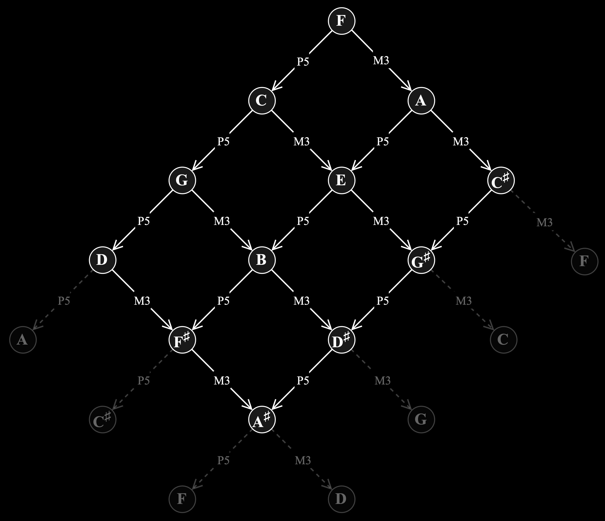

### TODO
- print_sound functions (wav and MIDI)
- signal-decorated tonnetz

<picture>
  <source srcset="docs/images/dissig_logo_dark.jpg" media="(prefers-color-scheme: dark)">
  <source srcset="docs/images/dissig_logo_light.jpg" media="(prefers-color-scheme: light)">
  
</picture>

# **Tonal Structures**<br><small>*for*</small> **Harmonic Motion**<br><small>*between*</small> **Discrete Signals**

Welcome to `disig`, a Python package that allows users to compute and manipulate [...]

## Harmonic movement between discrete signals

### Euler's *tonnetz*
[...]

<figure style="text-align: center;">
  <picture>
    <source srcset="docs/images/euler_tonnetz_dark.jpg" media="(prefers-color-scheme: dark)">
    <source srcset="docs/images/euler_tonnetz_light.jpg" media="(prefers-color-scheme: light)">
    
  </picture>
  <figcaption style="font-size: 0.9em; margin-top: 0.5em;">
    Euler's tone network ("tonnetz")
  </figcaption>
</figure>

[...]

<figure style="text-align: center;">
  <picture>
    <source srcset="docs/images/euler_modern_dark.jpg" media="(prefers-color-scheme: dark)">
    <source srcset="docs/images/euler_modern_light.jpg" media="(prefers-color-scheme: light)">
    
  </picture>
  <figcaption style="font-size: 0.9em; margin-top: 0.5em;">
    Modernized version of Euler's tone network ("tonnetz")
  </figcaption>
</figure>

[...]

### Modern tonnetze

[...]

### Tonnetze for discrete audio signals

[...]

<figure style="text-align: center;">
  <picture>
    <source srcset="docs/images/tonnetz_36_dark.jpg" media="(prefers-color-scheme: dark)">
    <source srcset="docs/tonnetz_36_light.jpg" media="(prefers-color-scheme: light)">
    
  </picture>
  <figcaption style="font-size: 0.9em; margin-top: 0.5em;">
    Tonnetz for discrete audio signals with 36 samples
  </figcaption>
</figure>


[...]

### Tonnetze

## 📦 Project Structure
```bash
.
├── docs/ # External references, images, and LaTeX sources
├── src/dissig/ # Python package source code
├── tests/ # Unit tests
├── pyproject.toml # Project configuration for PDM
├── requirements.txt # Compatibility requirements (optional)
└── README.md # This file
```

## 🚀 Installation

Using [PDM](https://pdm.fming.dev):

```bash
pdm install
```
Or using pip (if necessary):
```bash
pip install -e .
```

## 🔧 Usage
Example usage:

```python
from dissig.core import run_pipeline

data = ...         # Load your input
config = {...}     # Define configuration
result = run_pipeline(data, config)
```

## 🧪 Running Tests
```bash
pdm run pytest
```

## 📄 Documentation
[...]
- Images: docs/images/
- LaTeX files: docs/tex/
- External references: docs/external/

## 🛠 Development
Set up your development environment:
```bash
pdm install --dev
```
To enable import resolution in VSCode:

```jsonc
// .vscode/settings.json
{
  "python.analysis.extraPaths": ["./src"]
}
```

## 📝 License
This project is licensed under the terms of the MIT License.